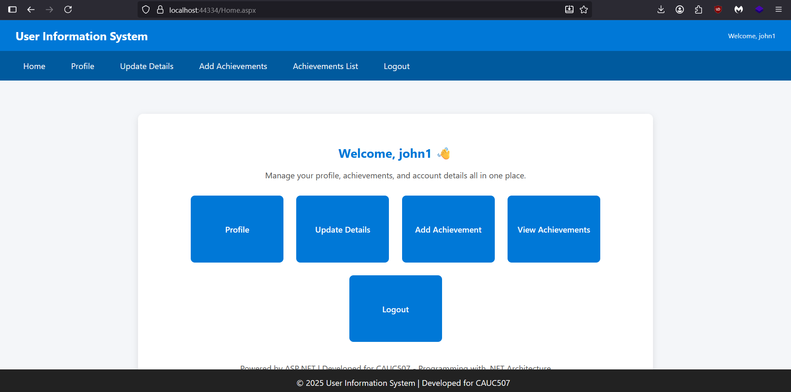
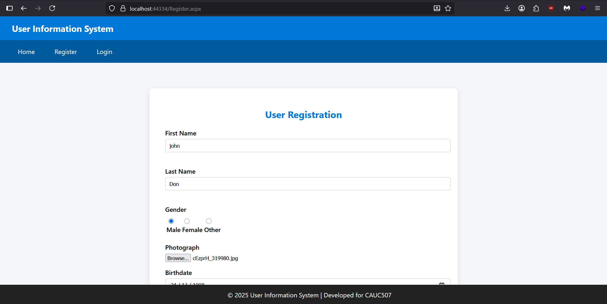
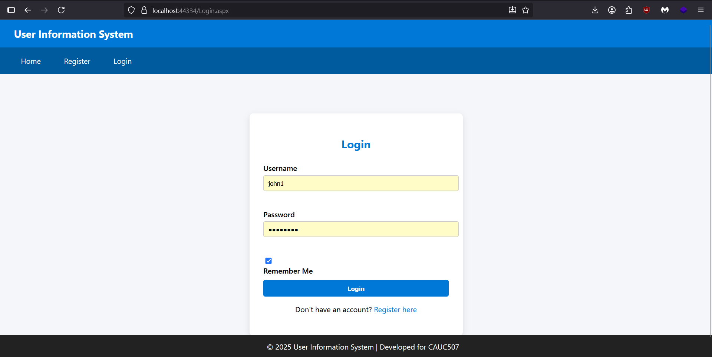
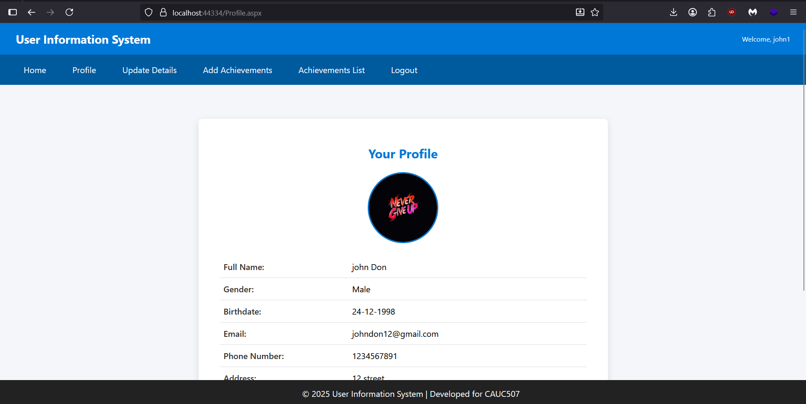
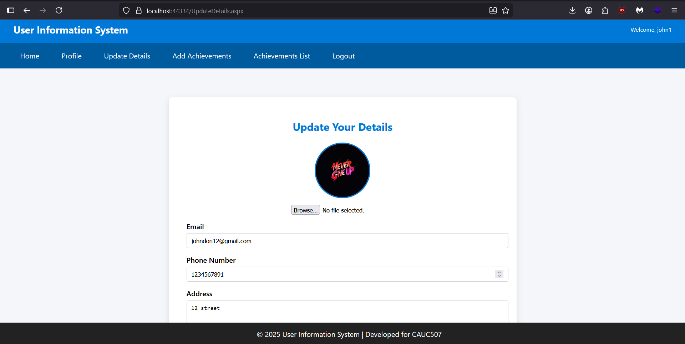
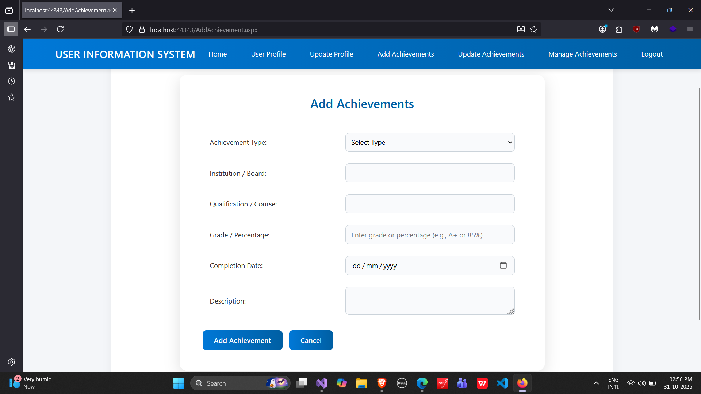

# User Information System

## Introduction

The **User Information System** is a web-based application developed using **ASP.NET Web Forms (C#)** and **SQL Server (LocalDB)**.  
It provides a secure and structured way for users to register, manage, and update their personal information, including profile photos and achievements.  
The system is designed to demonstrate practical implementation of **CRUD operations**, **session management**, and **data-driven web development** using ASP.NET.

This project was developed as part of the *CAUC507 – Programming with .NET Architecture* coursework.

---

## Features

- **User Registration:**  
  Register new users with personal details and profile photo upload.

- **User Authentication:**  
  Secure login and logout with session management.

- **Profile Management:**  
  View and edit personal information including address, contact details, and profile image.

- **Achievements Module:**  
  Add, view, and manage academic or personal achievements.

- **Dynamic User Interface:**  
  Clean and responsive UI using ASP.NET Web Forms and master page integration.

- **Database Integration:**  
  SQL Server (LocalDB) is used to store user and achievement data securely.

- **Photo Handling:**  
  Upload, store, and update profile images directly from the browser.

---

## Technologies Used

- **Frontend:** ASP.NET Web Forms, HTML5, CSS3  
- **Backend:** C#  
- **Database:** SQL Server (LocalDB)  
- **IDE:** Visual Studio 2022  
- **Server:** IIS Express  

---

## Screenshots

| Page | Description | Preview |
|------|--------------|----------|
| **Home Page** | Landing page after login |  |
| **Register Page** | User registration form |  |
| **Login Page** | Secure user login |  |
| **Profile Page** | Displays user details and photo |  |
| **Update Details** | Allows editing and uploading new profile photo |  |
| **Achievements List** | Displays added achievements |  |

---

Author
Shalin Christian
Full Stack Developer | ASP.NET | SQL Server | C#
